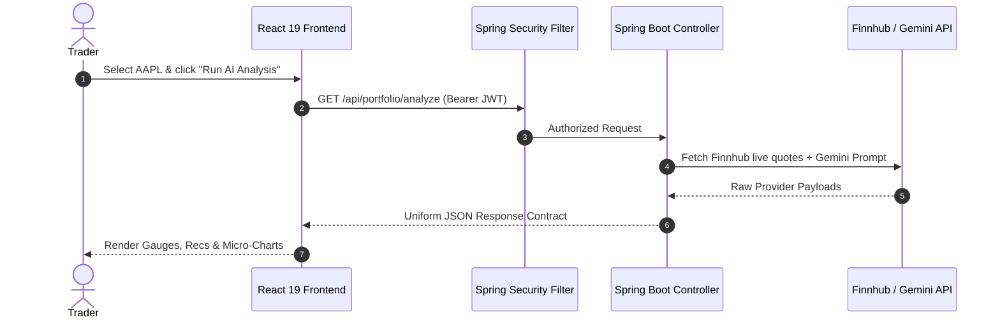

# Required Java Spring Boot API Specification for React Frontend

**Target System**: Java Spring Boot 3.x (`stock-backend`)  
**Frontend Client**: React 19 + Tailwind CSS + Axios (`stock-frontend`)  
**Base URL**: `http://localhost:8080`  
**Authentication Scheme**: Bearer Token in HTTP Authorization Header (`Authorization: Bearer <jwt_token>`)  
**Content-Type**: `application/json`

---

## Table of Contents
1. [Architecture Overview & Authentication Interceptor](#1-architecture-overview--authentication-interceptor)
2. [Market Data: Real-Time Stock Quotes (Finnhub Equivalent)](#2-market-data-real-time-stock-quotes-finnhub-equivalent)
3. [Market Data: Historical Chart Data (Alpha Vantage Equivalent)](#3-market-data-historical-chart-data-alpha-vantage-equivalent)
4. [Market Data: Ticker Autocomplete & Search](#4-market-data-ticker-autocomplete--search)
5. [AI Intelligence: Gemini 1.5 Pro Portfolio Advisor](#5-ai-intelligence-gemini-15-pro-portfolio-advisor)
6. [Core Portfolio Operations (Ledger, Buy & Sell)](#6-core-portfolio-operations-ledger-buy--sell)
7. [Authentication & Session Endpoints](#7-authentication--session-endpoints)
8. [Standardized Error Response Specification](#8-standardized-error-response-specification)
9. [Java Spring Boot Controller & DTO Code Snippets](#9-java-spring-boot-controller--dto-code-snippets)

---

## 1. Architecture Overview & Authentication Interceptor

The React frontend uses Axios via `src/services/apiClient.js` configured as follows:
- Automatically injects `Authorization: Bearer <token>` into headers for every request when a user token exists in `localStorage`.
- All routes starting with `/api/portfolio/**` require a valid JWT token.
- Market lookup routes under `/api/stocks/**` can either be authenticated or publicly accessible depending on Spring Security filter rules.



---

## 2. Market Data: Real-Time Stock Quotes (Finnhub Equivalent)

Used by: `src/pages/BuySellPage.jsx`, `src/components/WatchlistChartCard.jsx`, `src/services/portfolioService.js#getStockQuote`

### `GET /api/stocks/{symbol}`

- **Description**: Fetches the latest live market price, daily dollar change, daily percentage change, high, low, and volume for an equity ticker.
- **Path Parameter**:
  - `symbol` *(string, required)*: Ticker symbol in uppercase (e.g., `AAPL`, `NVDA`, `TSLA`, `MSFT`).
- **Security**: Public or Authenticated (`Bearer JWT`).

#### Expected Response: `200 OK`
```json
{
  "symbol": "AAPL",
  "price": 235.45,
  "change": 3.20,
  "changePercent": 1.38,
  "high": 236.10,
  "low": 232.80,
  "open": 233.00,
  "previousClose": 232.25,
  "volume": 52140000,
  "timestamp": 1727289600000
}
```

#### Field Specifications:
| Field | Type | Required | Description |
| :--- | :--- | :--- | :--- |
| `symbol` | `String` | Yes | Ticker symbol (e.g., `"AAPL"`). |
| `price` | `Double` | Yes | **Crucial:** Current mark-to-market live price consumed by `setLivePrice(Number(quote.price))` and order calculations. |
| `change` | `Double` | Yes | Net dollar price change from previous day's close. |
| `changePercent` | `Double` | Yes | Percentage change from previous close (e.g., `1.38` for +1.38%). |
| `high` | `Double` | No | Session high price. |
| `low` | `Double` | No | Session low price. |
| `open` | `Double` | No | Market opening price. |
| `previousClose` | `Double` | No | Previous trading session close price. |
| `volume` | `Long` | No | Cumulative shares traded in the session. |
| `timestamp` | `Long` | No | Epoch millisecond timestamp of the quote. |

---

## 3. Market Data: Historical Chart Data (Alpha Vantage Equivalent)

Used by: `src/pages/BuySellPage.jsx`, `src/components/WatchlistChartCard.jsx`, `src/services/portfolioService.js#getStockHistory`

### `GET /api/stocks/history/{symbol}`

- **Description**: Returns chronological price datapoints used directly by Recharts `<AreaChart />` and `<ResponsiveContainer />`.
- **Path Parameter**:
  - `symbol` *(string, required)*: Ticker symbol (e.g., `NVDA`, `AAPL`).
- **Query Parameter**:
  - `range` *(string, optional, default: `'1D'`)*: Time window selected on the frontend chart tabs.
    - Supported values: `'1D'`, `'1W'`, `'1M'`, `'1Y'`, `'ALL'`.

#### Expected Response: `200 OK`
```json
[
  { "time": "09:30", "price": 232.50 },
  { "time": "10:00", "price": 233.15 },
  { "time": "10:30", "price": 234.00 },
  { "time": "11:00", "price": 233.80 },
  { "time": "11:30", "price": 234.60 },
  { "time": "12:00", "price": 235.10 },
  { "time": "12:30", "price": 234.90 },
  { "time": "13:00", "price": 235.45 },
  { "time": "13:30", "price": 235.20 },
  { "time": "14:00", "price": 235.85 },
  { "time": "14:30", "price": 235.60 },
  { "time": "15:00", "price": 236.10 },
  { "time": "15:30", "price": 235.75 },
  { "time": "16:00", "price": 235.45 }
]
```

#### Field Specifications:
| Field | Type | Required | Description |
| :--- | :--- | :--- | :--- |
| `time` | `String` | Yes | Human-readable label for X-axis (e.g., `"09:30"` for 1D, `"Mon"` / `"Tue"` for 1W, or `"Oct 12"` for 1M/1Y). |
| `price` | `Double` | Yes | Price level plotted on Y-axis. Must be a valid numeric finite value. |

---

## 4. Market Data: Ticker Autocomplete & Search

Used by: `src/pages/BuySellPage.jsx`, `src/services/portfolioService.js#searchStocks`

### `GET /api/stocks/search`

- **Description**: Debounced ticker search for matching company name or ticker query.
- **Query Parameter**:
  - `q` *(string, required)*: Search substring (e.g., `q=AAP` or `q=micro`).

#### Expected Response: `200 OK`
```json
{
  "count": 4,
  "result": [
    {
      "symbol": "AAPL",
      "description": "APPLE INC",
      "type": "Common Stock"
    },
    {
      "symbol": "AAP",
      "description": "ADVANCE AUTO PARTS INC",
      "type": "Common Stock"
    },
    {
      "symbol": "AAPL.NE",
      "description": "APPLE INC - CDR",
      "type": "CDR"
    },
    {
      "symbol": "AA",
      "description": "ALCOA CORP",
      "type": "Common Stock"
    }
  ]
}
```

---

## 5. AI Intelligence: Gemini 1.5 Pro Portfolio Advisor

Used by: `src/components/AiAdvisorModal.jsx`, `src/services/portfolioService.js#analyzePortfolio`

### `GET /api/portfolio/analyze`

- **Description**: Synthesizes the authenticated user's ledger holdings, prompts Google Gemini 1.5 Pro, and delivers structured diagnostic metrics, risk scores, vulnerabilities, and position-level recommendations.
- **Security**: Authenticated (`Authorization: Bearer <jwt_token>`).

#### Expected Response: `200 OK`
```json
{
  "portfolioScore": 84,
  "diversificationScore": 72,
  "riskLevel": "MODERATE",
  "summary": "Your portfolio demonstrates strong tech allocation with high growth momentum, but exhibits moderate concentration risk in mega-cap equities.",
  "strengths": [
    "Substantial exposure to leading AI and semiconductor megatrends (NVDA, MSFT)",
    "Adequate cash liquidity cushion preserving agility during market pullbacks",
    "Positive unrealized alpha across early entered blue-chip positions"
  ],
  "weaknesses": [
    "Top 2 positions account for over 55% of total portfolio equity weight",
    "Zero allocation to defensive dividend, consumer staples, or fixed-income instruments",
    "High sensitivity to NASDAQ tech volatility (beta > 1.35)"
  ],
  "recommendations": [
    {
      "symbol": "NVDA",
      "action": "HOLD",
      "confidence": 88,
      "reason": "Strong ongoing datacenter momentum; hold core position while setting trailing stops."
    },
    {
      "symbol": "AAPL",
      "action": "BUY",
      "confidence": 92,
      "reason": "Stable free cash flow and resilient ecosystem offer ideal defense."
    },
    {
      "symbol": "TSLA",
      "action": "REDUCE",
      "confidence": 74,
      "reason": "Trim 15-20% to mitigate margin compression and EV cyclical headwind."
    }
  ],
  "improvements": [
    "Rebalance 10% into uncorrelated sectors (e.g., Healthcare XLV or Energy XLE)",
    "Implement automated stop-loss limit thresholds on high-beta semiconductor positions",
    "Dollar-cost average newly injected virtual liquidity over weekly intervals"
  ],
  "overallRecommendation": "Maintain current high-conviction growth anchors while deploying incoming capital toward defensive hedges to insulate against macroeconomic shocks."
}
```

#### Field Specifications:
| Field | Type | Format / Constraints | Description |
| :--- | :--- | :--- | :--- |
| `portfolioScore` | `Integer` | 0 – 100 | Visualized via SVG circular progress gauge (green $\ge 75$, amber $50-74$, red $<50$). |
| `diversificationScore` | `Integer` | 0 – 100 | Visualized via SVG circular progress gauge. |
| `riskLevel` | `String` | `"LOW"`, `"MODERATE"`, `"HIGH"` | Renders formatted risk badge chip. |
| `summary` | `String` | Multi-sentence markdown/text | Executive analysis summary card. |
| `strengths` | `Array<String>` | List of strings | Rendered with green checkmark bullets. |
| `weaknesses` | `Array<String>` | List of strings | Rendered with rose warning alert bullets. |
| `recommendations` | `Array<Object>` | List of position recs | Evaluated position cards with confidence progress bar. |
| `recommendations[].symbol` | `String` | Uppercase ticker | Symbol displayed alongside StockLogo badge. |
| `recommendations[].action` | `String` | `"BUY"`, `"HOLD"`, `"REDUCE"`, `"SELL"`, `"REVIEW"` | Styled with distinct green, blue, amber, or rose pills. |
| `recommendations[].confidence`| `Integer` | 0 – 100 | Drives horizontal fill progress bar. |
| `recommendations[].reason` | `String` | Sentence explanation | Quoted rationalization behind the AI recommendation. |
| `improvements` | `Array<String>` | List of strings | Actionable steps with arrow icon bullets. |
| `overallRecommendation` | `String` | Concluding thesis | Highlighted hero callout card at the base of the modal. |

---

## 6. Core Portfolio Operations (Ledger, Buy & Sell)

Used by: `src/pages/DashboardPage.jsx`, `src/pages/PortfolioPage.jsx`, `src/components/TradeForm.jsx`, `src/context/AuthProvider.jsx`

### `GET /api/portfolio`
- **Query Parameters**:
  - `page` *(int, default: `0`)*: Zero-indexed page number.
  - `size` *(int, default: `5` or `10`)*: Page size limit.
  - `sort` *(string, optional)*: e.g. `holdingValue,desc`.

#### Expected Response: `200 OK`
```json
{
  "totalPortfolioValue": 108450.25,
  "cashBalance": 74210.50,
  "totalProfitLoss": 8450.25,
  "totalProfitLossPercentage": 8.45,
  "holdings": [
    {
      "symbol": "AAPL",
      "quantity": 50,
      "avgPrice": 220.00,
      "currentPrice": 235.45,
      "holdingValue": 11772.50,
      "profitLoss": 772.50,
      "profitLossPercentage": 7.02,
      "allocationPercentage": 34.38
    },
    {
      "symbol": "NVDA",
      "quantity": 18,
      "avgPrice": 115.00,
      "currentPrice": 125.60,
      "holdingValue": 2260.80,
      "profitLoss": 190.80,
      "profitLossPercentage": 9.21,
      "allocationPercentage": 6.60
    }
  ],
  "totalPages": 1,
  "totalElements": 2,
  "pageNumber": 0
}
```

---

### `POST /api/portfolio/buy`
- **Request Body**:
```json
{
  "symbol": "AAPL",
  "quantity": 10
}
```

#### Expected Response: `200 OK`
```json
{
  "success": true,
  "message": "Order Executed: Bought 10 share(s) of AAPL",
  "symbol": "AAPL",
  "quantity": 10,
  "executionPrice": 235.45,
  "totalCost": 2354.50,
  "remainingCashBalance": 71856.00
}
```

---

### `POST /api/portfolio/sell`
- **Request Body**:
```json
{
  "symbol": "AAPL",
  "quantity": 5
}
```

#### Expected Response: `200 OK`
```json
{
  "success": true,
  "message": "Order Executed: Sold 5 share(s) of AAPL",
  "symbol": "AAPL",
  "quantity": 5,
  "executionPrice": 235.45,
  "totalProceeds": 1177.25,
  "remainingCashBalance": 73033.25
}
```

---

## 7. Authentication & Session Endpoints

Used by: `src/pages/LoginPage.jsx`, `src/pages/RegisterPage.jsx`, `src/services/authService.js`

### `POST /api/auth/login`
- **Request Body**:
```json
{
  "email": "trader@portfolio.com",
  "password": "SecurePassword123!"
}
```

#### Expected Response: `200 OK`
```json
{
  "token": "eyJhbGciOiJIUzI1NiIsInR5cCI6IkpXVCJ9...",
  "email": "trader@portfolio.com",
  "name": "Alex Trader"
}
```

---

### `POST /api/auth/register`
- **Request Body**:
```json
{
  "name": "Alex Trader",
  "email": "trader@portfolio.com",
  "password": "SecurePassword123!"
}
```

#### Expected Response: `200 OK`
```json
{
  "token": "eyJhbGciOiJIUzI1NiIsInR5cCI6IkpXVCJ9...",
  "email": "trader@portfolio.com",
  "name": "Alex Trader"
}
```

---

## 8. Standardized Error Response Specification

When an error occurs (such as insufficient balance, invalid ticker, or unauthorized request), the backend must respond with a JSON body matching this format:

```json
{
  "status": 400,
  "message": "Insufficient cash balance. Available: $500.00, Order Cost: $2354.50",
  "timestamp": "2026-09-25T17:45:00.000Z"
}
```

The React frontend catches `requestError.response?.data?.message` and displays this cleanly in alert banners across forms and modals.

---

## 9. Java Spring Boot Controller & DTO Code Snippets

For reference and frictionless integration into `stock-backend` without altering existing business logic:

### AI Advisor DTO Definition:
```java
package com.portfolio.dto;

import java.util.List;

public record AiAdvisorResponseDto(
    int portfolioScore,
    int diversificationScore,
    String riskLevel,
    String summary,
    List<String> strengths,
    List<String> weaknesses,
    List<RecommendationDto> recommendations,
    List<String> improvements,
    String overallRecommendation
) {
    public record RecommendationDto(
        String symbol,
        String action, // "BUY", "HOLD", "REDUCE", "SELL"
        int confidence,
        String reason
    ) {}
}
```

### Stock Quote DTO Definition:
```java
package com.portfolio.dto;

public record StockQuoteDto(
    String symbol,
    Double price,
    Double change,
    Double changePercent,
    Double high,
    Double low,
    Double open,
    Double previousClose,
    Long volume,
    Long timestamp
) {}
```

### Historical Data Point DTO Definition:
```java
package com.portfolio.dto;

public record ChartPointDto(
    String time,
    Double price
) {}
```
